<!-- _class: title invert -->

# TITRE DE LA PRESENTATION

## NOM DU CLIENT

### 01/04/2020

---

<!-- _class: orange speaker invert -->

# About me

## Michaël FERY

- DevOps
- Cloud
- Azure MVP
- Microsoft Certified Trainer

[ _mfery](https://twitter.com/_mfery)

[ mfery](https://www.linkedin.com/in/mfery/)

---

<!-- _class: purple agenda invert lead -->

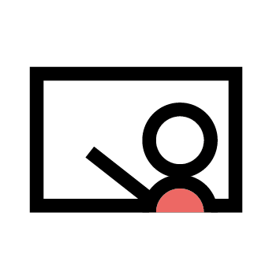

# Agenda - Jour 1

- Le titre
- La page du formateur/speaker
- Agenda
- Les chapitres et ses variantes
- Les pages 'classiques'
- Les pause et workshop
- Fonds, notes, listes, etc.
- Les pages multi-colonnes
- Pictos
- Page de fin

`<!-- _class: purple agenda invert -->`

---

<!-- _class: green chapter invert -->

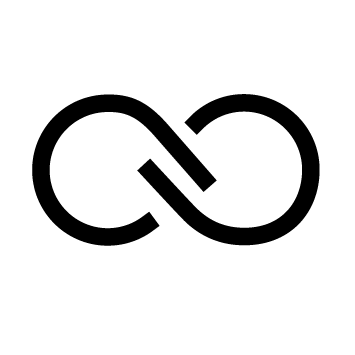

# 1

## Voici une page de chapitre

### `<!-- _class: chapter invert -->`

---

<!-- _class: blue chapter invert -->


# 2

## Vous pouvez changer de couleur de chapitre (red, green, blue, orange, purple)

### `<!-- _class: blue chapter invert -->`

---

# Titre

Dans une page classique sans style défini, le titre `<h2>` ou `##` est affiché en haut de page avec un fond de couleur.

```markdown
# Titre

Dans une page classique sans style défini, le titre `<h2>` ou `##` est affiché en haut de page avec un fond de couleur.
```

---


Vous pouvez définir une image de background

``

---

<!-- _class: green break lead invert -->

# Break

## 15 minutes

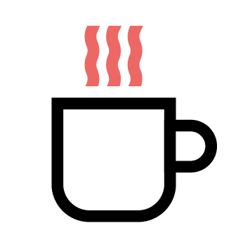

```markdown
<!-- _class: green break lead invert -->

# Break

## 15 minutes


```

---

<!-- _class: red workshop invert lead -->

# Workshop

## Voici une page de workshop avec une image à définir

`<!-- _class: red workshop invert lead -->`

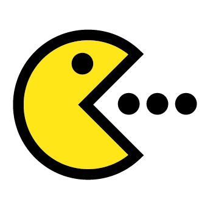

---

# Les notes de présentateur

Pour définir des notes de présentateur, utilisez les commentaires html

`<!-- Vous retrouverez ces notes dans les versions pptx et html notamment -->`

---

# Titre

Dans une page classique sans style défini, le titre `<h2>` ou `##` est affiché en haut de page avec un fond de couleur.

```markdown
# Titre

Dans une page classique sans style défini, le titre `<h2>` ou `##` est affiché en haut de page avec un fond de couleur.
```

---

# Liste

- Les listes avec `-`
- ne sont **pas fragmentées**

* Les listes avec `*`
* sont **fragmentées** (html seulement)

1. Vous pouvez aussi
2. utiliser des listes **numérotées**

---

# Code sample

\```bash
git commit --amend
git rebase
git cherry-pick
gitmerge --squash
\```

Le code précédent afficher ce résultat

```bash
git commit --amend
git rebase
git cherry-pick
gitmerge --squash
```

---

# Images

Vous pouvez manipuler des images avec la directive `center`, `h`, `w` et `opacity`:

``


---

# Multi-colonnes

<div class="row">
  <div class="column" style="width: 20%">
    <p>
        L'utilisation de code html est utilisé pour définir des colonnes avec les classes <b>row</b> et <b>column</b>
    </p>
  </div>
  <div class="column" style="width: 80%;background:lightgray;">
    <p>
      &lt;div <b>class="row"</b>&gt;<br/>
      &emsp;&lt;div <b>class="column"</b> <b>style="width: 30%"</b>&gt;<br/>
      &emsp;&emsp;&lt;p&gt;
        L'utilisation de code html est utilisé pour définir des colonnes avec les classes <b>row</b> et <b>column</b>
      &lt;/p&gt;<br/>
      &emsp;&lt;/div&gt;<br/>
      &emsp;&lt;div <b>class="column"</b> <b>style="width: 70%"</b>&gt;<br/>
      &emsp;&emsp;&lt;p&gt;
        ...
      &lt;/p&gt;<br/>
      &emsp;&lt;/div&gt;
      &lt;/div&gt;
    </p>
  </div>
</div>

---


> The most powerful tool we have as developers is automation.
>> [Scott Hanselman][1]

[1]: https://en.wikipedia.org/wiki/Creativity

---

# Pictos

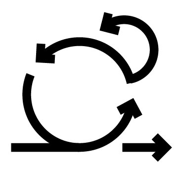    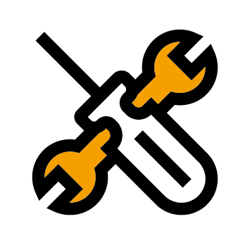  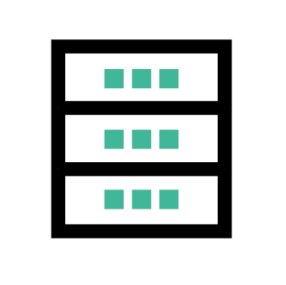 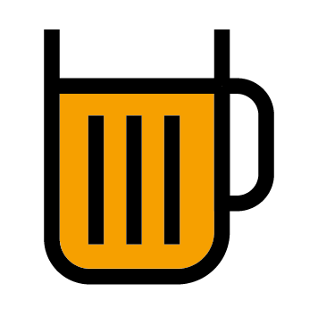 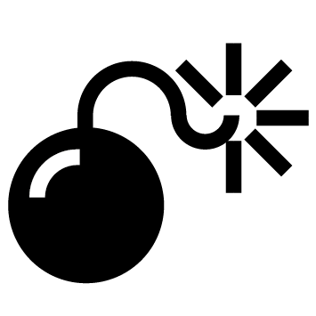 

    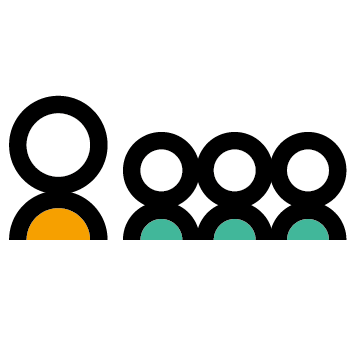 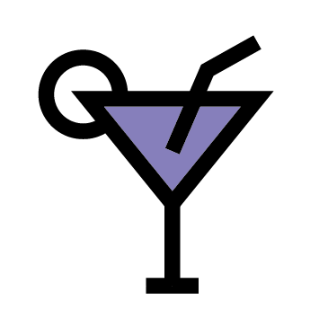    

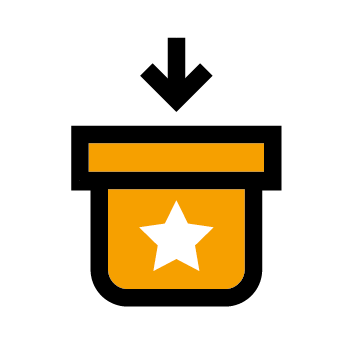    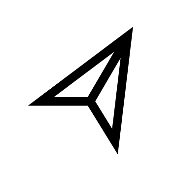    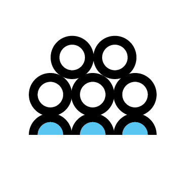 

       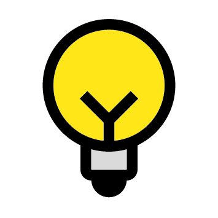  

---

<!-- _class: end invert lead-->

# Et voici le template de page de fin
